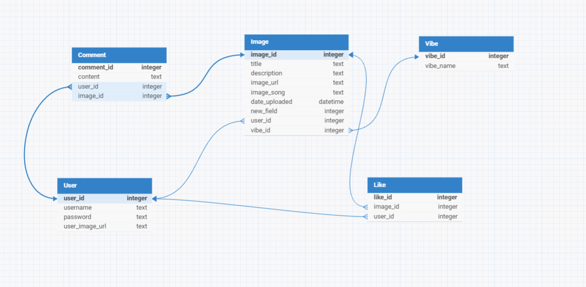

# Vibeur
Share your moments and vibes!

### Vibeur is a app that displays a new way of social interactions! This platform offers a unique blend of visual storytelling with vibe-based music sharing. It allows users to express their emotions and creativity, find inspiration, connections, and comfort within the Vibeur community!

# User Stories

## User

### User Registration
- Users can create an account by providing a username and password.
- Users may optionally upload a profile picture.

### User Login/Logout
- Users can log in using their credentials.
- Users can log out securely.

### Profile Management
- Users can update their profile picture.

## Image

### Upload image
- Logged in users can upload an image with a title, description, vibe song URL, and vibe.
- Upload date and user ID are automatically recorded.
- If you are not logged in, do not allow creation of image

### Image Viewing

- Users can browse uploaded images, view titles, descriptions, and listen to associated mood songs.

- Images can be filtered or sorted by upload date uploaded, vibe, likes, user's images.

- Anyone can view whether logged in or not.

### Image Management

- Logged in users can delete or edit their own uploaded images (title, description).

## Likes

### Liking

- Logged in users may like an Image which records their user ID, the image ID.

- Logged in users can unlike an image, removing the like entry.

### Like Viewing

- View Like Count

- Anyone can view the total number of likes for each image.

## Comment

### Comment on an Image

- Logged in Users can leave a comment on an image.

- Comments are stored with a timestamp for reference.

- Logged in users can edit and delete their own comments.

### Comment Viewing

- Anyone can view all comments on an image.

# Database Schema

### User Table
- user_id integer pk increments unique
- username text
- password text
- user_image_url text null

### Vibe Table
- vibe_id integer pk increments unique
- vibe_name text

### Image Table
- image_id integer pk increments unique
- title text
- description text
- image_url text
- image_song text
- date_uploaded datetime
- user_id integer > fk references user.user_id
- vibe_id integer > fk references vibe.vibe_id

### Comment Table
- comment_id integer pk increments unique
- content text
- user_id integer > fk references user.user_id
- image_id integer > fk references image.image_id

### Like Table
like_id integer pk increments unique
image_id integer > fk references image.image_id
user_id integer > fk references user.user_id
