# Vibeur
Share your moments and vibes!

### Vibeur is a app that displays a new way of social interactions! This platform offers a unique blend of visual storytelling with vibe-based music sharing. It allows users to express their emotions and creativity, find inspiration, connections, and comfort within the Vibeur community!

# User Stories

## User

### User Registration
- Users can create an account by providing a username and password.
- Users may optionally upload a profile picture.

### User Login/Logout
- Users can log in using their credentials.
- Users can log out securely.

### Profile Management
- Users can update their profile picture.

## Vibes

### Upload Vibe
- Logged in users can upload an vibe with a title, description, vibe song URL, and vibe.
- Upload date and user ID are automatically recorded.
- If you are not logged in, do not allow creation of vibe

### Vibe Viewing

- Users can browse uploaded vibes, view titles, descriptions, and listen to associated Vibe songs.

- vibes can be filtered or sorted by upload date uploaded, vibe, likes, user's vibes.

- Anyone can view whether logged in or not.

### Vibe Management

- Logged in users can delete or edit their own uploaded vibes (title, description).

## Likes

### Liking

- Logged in users may like an Image which records their user ID, the image ID.

- Logged in users can unlike an image, removing the like entry.

### Like Viewing

- View Like Count

- Anyone can view the total number of likes for each image.

## Comment

### Comment on an Image

- Logged in Users can leave a comment on an image.

- Comments are stored with a timestamp for reference.

- Logged in users can edit and delete their own comments.

### Comment Viewing

- Anyone can view all comments on an image.

# Database Schema

- renamed vibe table to => mood
- renamed image table to -> vibe

### User Table
- user_id integer pk increments unique
- username text
- password text
- user_image_url text null

### Mood Table
- mood_id integer pk increments unique
- mood_name text

### Vibe Table
- vibe_id integer pk increments unique
- title text
- description text
- vibe_url text
- vibe_song text
- date_uploaded datetime
- user_id integer > fk references user.user_id
- mood_id integer > fk references mood.mood_id

### Comment Table
- comment_id integer pk increments unique
- content text
- user_id integer > fk references user.user_id
- vibe_id integer > fk references vibe.vibe_id

### Like Table
like_id integer pk increments unique
vibe_id integer > fk references vibe.vibe_id
user_id integer > fk references user.user_id

# Wireframes

## Not logged in user viewing Landing page
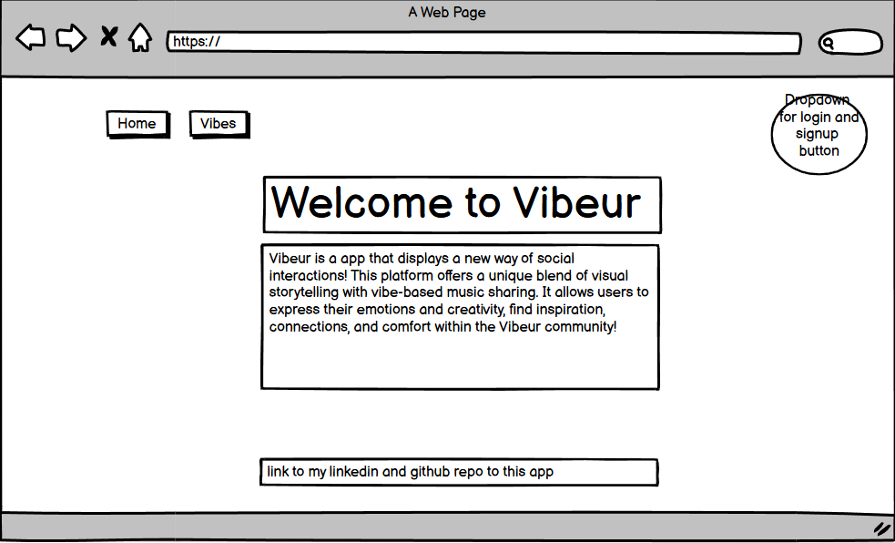

## Logged in user viewing Landing page
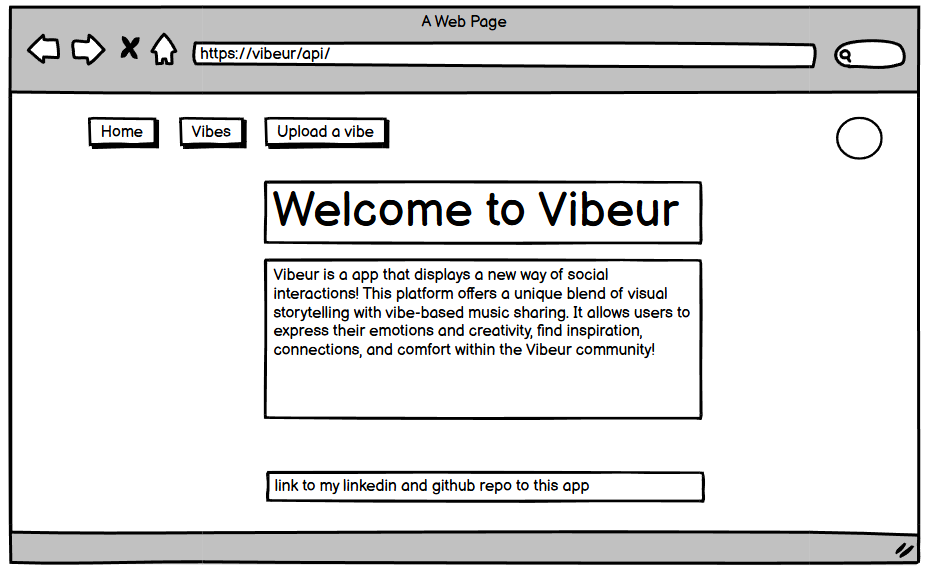

## Logged out user viewing Vibes
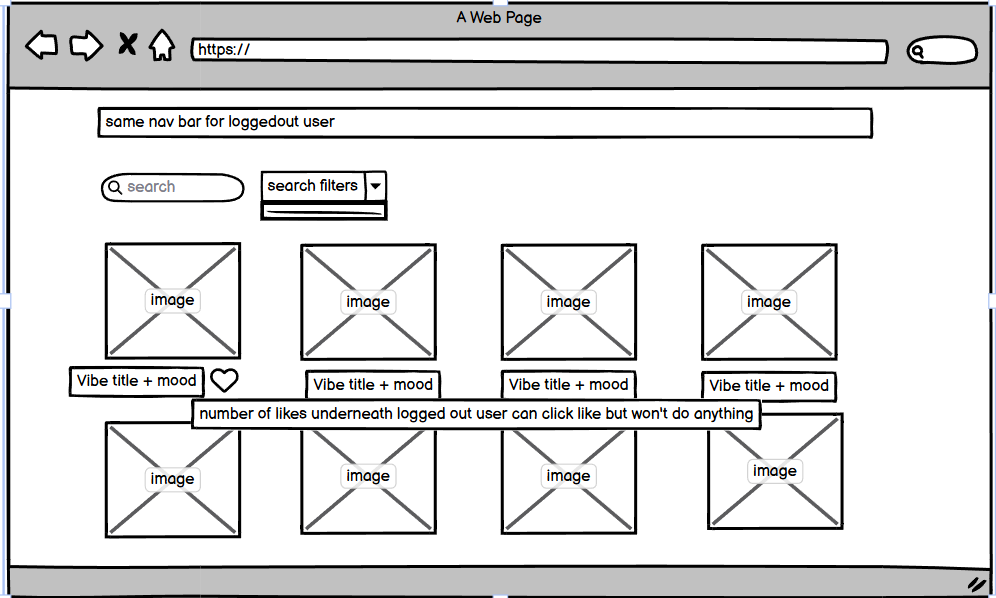

## Logged in user viewing Vibes
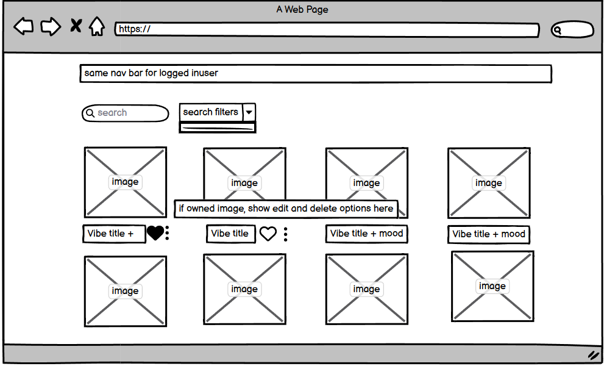

## Logged in user my vibes page
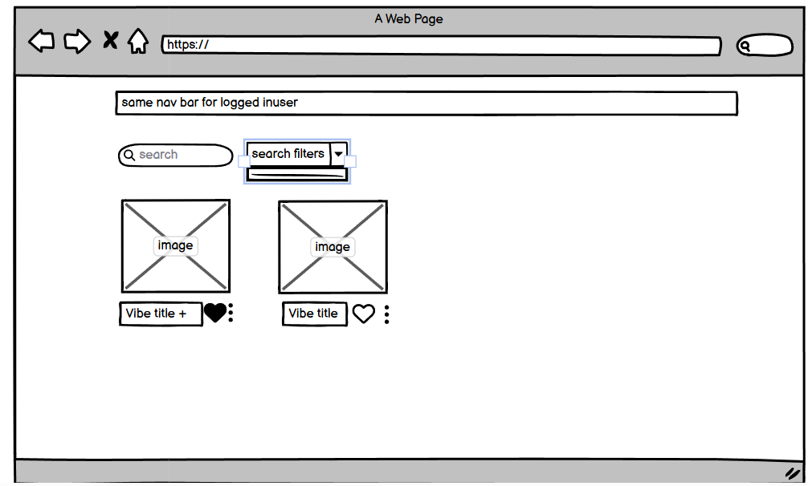

## Logged out user Vibe page 
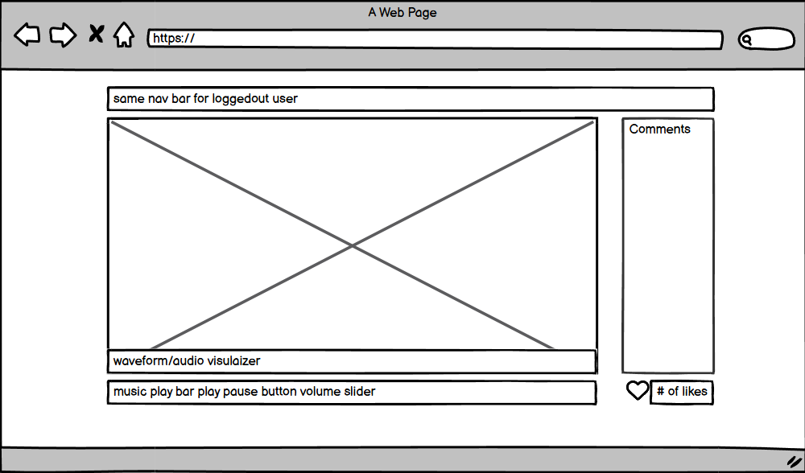

## Logged in user Vibe page 
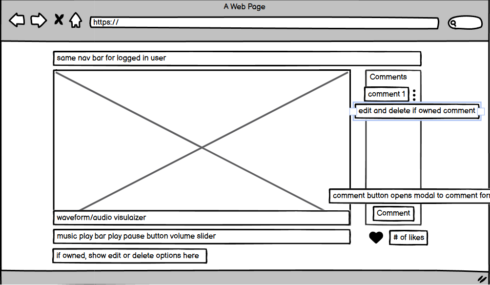

## Logged in user Comment form
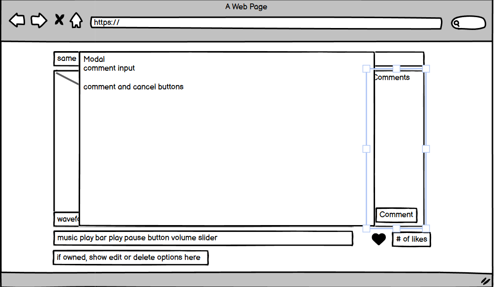

## Logged in user edit Comment form
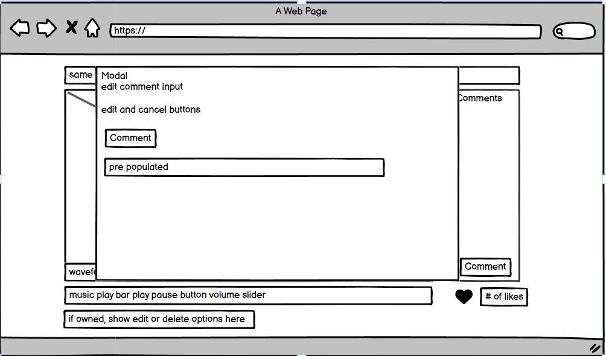

## Logged in user upload a vibe

## Logged in user edit a vibe
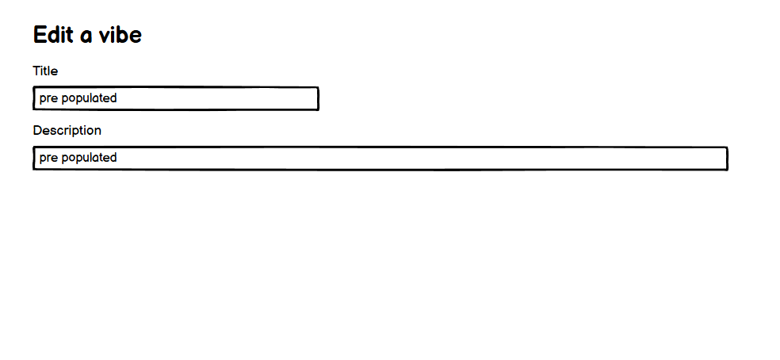

## Login
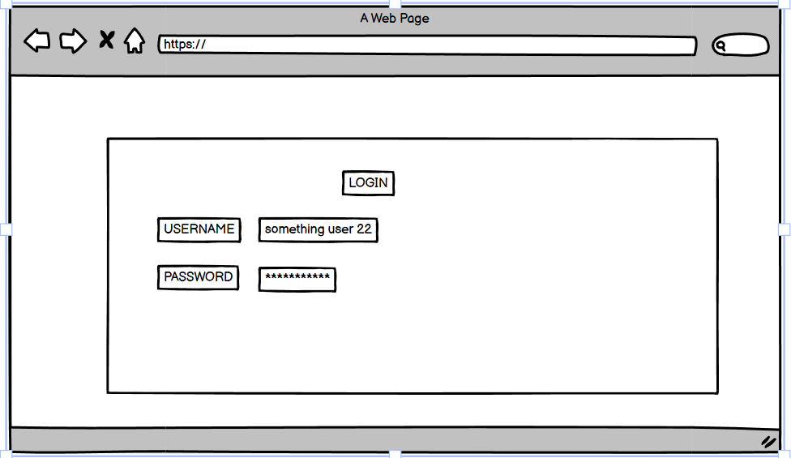

## Signup
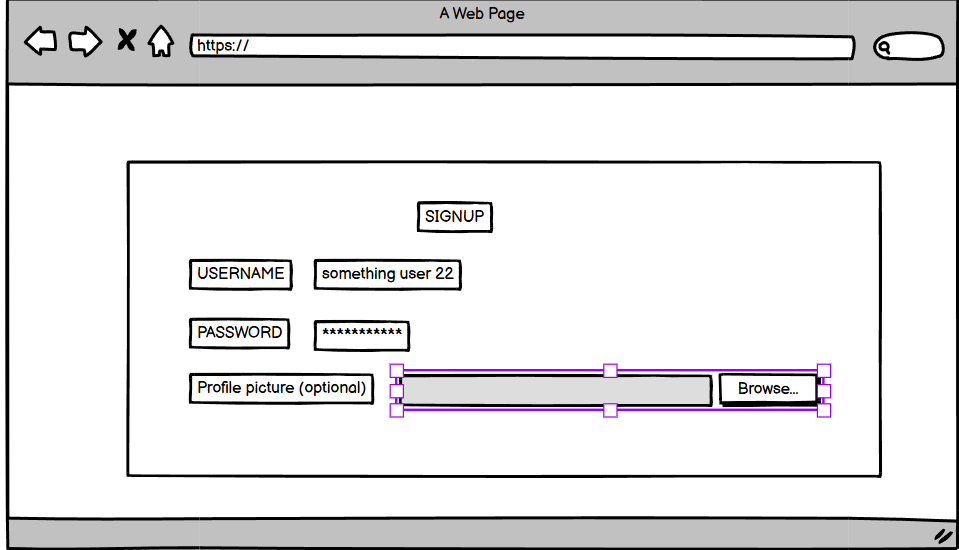

# Technology Stack
## Backend
- Java
- Spring
- JDBC Client
- MySQL
- BCrypt
- AWS S3 and Lambda
## Frontend
- React
- JSX
- Howler.JS
- AudioMotion
- GSAC animation library

# HTTP Endpoints

## Users
### GET /api/users/:userId/myVibes
- returns a list of vibes associated with this user Id

### GET /api/users/:userId/comments
- returns a list of comments associated with this user Id

### GET /api/users/:userId/likes
- returns a list of likes associated with this user Id

### PUT /api/users/:userId
- edit a user's profile picture associated with this user Id

## Vibes
### GET /api/vibes
- returns a list of all vibes

### GET /api/vibes/:vibeId
- returns a singular vibe associated with this vibe Id

### GET /api/vibes/:vibeId/comments
- returns a list of comments associated with this vibe Id

### GET /api/vibes/:vibeId/likes
- returns a list of likes associated with this vibe Id

### POST /api/vibes
- upload a vibe

### POST /api/vibes/:vibeId/likes
- create a like associated with this vibe Id and user Id from auth header

### PUT /api/vibes/:vibeId
- edit a vibe with the associated vibe Id

### DELETE /api/vibes/:vibeId
- delete a vibe with the associated vibe Id

## Comments
### GET /api/comments/:commentId
- returns a singular comment associated with this commentId

### POST /api/comments/:commentId
- create a comment associated with this commentId

### PUT /api/comments/:commentId
- edit a comment associated with this commentId

### DELETE /api/comments/:commentId
- delete a comment associated with this commentId

## Likes
### GET /api/likes
- returns a list of all likes

# Frontend components tree diagram
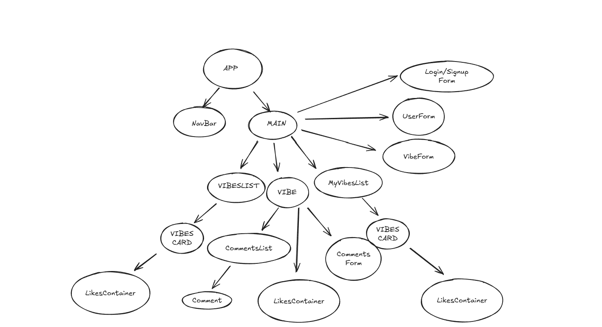

# Backend class and member inventory

## Mappers
- UserMapper
- VibeMapper
- CommentMapper
- LikeMapper
- MoodMapper

## Models

### User
- int userId
- String username
- String password
- String profilePictureLink

### Mood
- int moodId
- String moodName

### Vibe
- int vibeId
- String title
- String description
- String imageURL
- String songURL
- Date uploadDate
- Mood mood
- User user

### Comment
- int commentId
- String content
- User user
- Date createdDate 
- boolean isEdited
- int vibeId

### Like
- int likeId
- int userId
- int vibeId

## Repositories

### Users 
- findById returns a User
- existsByUsername(String username)
- create returns a User
- edit edits a User (only profile picture url)

### Vibes
- findById returns a Vibe
- findByUserId returns a List of Vibe
- create returns a Vibe
- edit edits a Vibe
- deleteById deletes a vibe

### Comments
- findById returns a comment
- findByVibeId returns a List of Comment
- create returns a comment
- edit edits a comment
- deleteById deletes a comment

### Like
- findAll returns a List of Like
- findByPostId returns a List of Like
- findByUserId returns a List of Like
- existsByUserIdAndVibeId boolean 
- deleteByUserIdAndVibeId deletes a like -> (Unlike)

## Service

### Users 
- findById returns a User
- create returns a Result<User>
- edit returns a Result<User>
- validate(checks for duplicate user names and nulls) returns a Result<User>

### Vibes
- findById returns a Vibe
- findByUserId returns a List of Vibe
- create returns a Result<Vibe>
- edit returns a Result<Vibe>
- deleteById returns a Result<Vibe>
- validate (just checks for nulls) returns a Result<Vibe>

### Comments
- findById returns a comment
- findByVibeId returns a List of Comment
- create returns a Result<Comment>
- edit returns a Result<Comment>
- deleteById returns a Result<Comment>
- validate (just checks for nulls) returns a Result<Comment>

### Like
- findAll returns a List of Like
- findByPostId returns a List of Like
- findByUserId returns a List of Like
- validate(checks to see if already liked) returns a Result<Like>
- deleteByUserIdAndVibeId returns a Result<Like>
